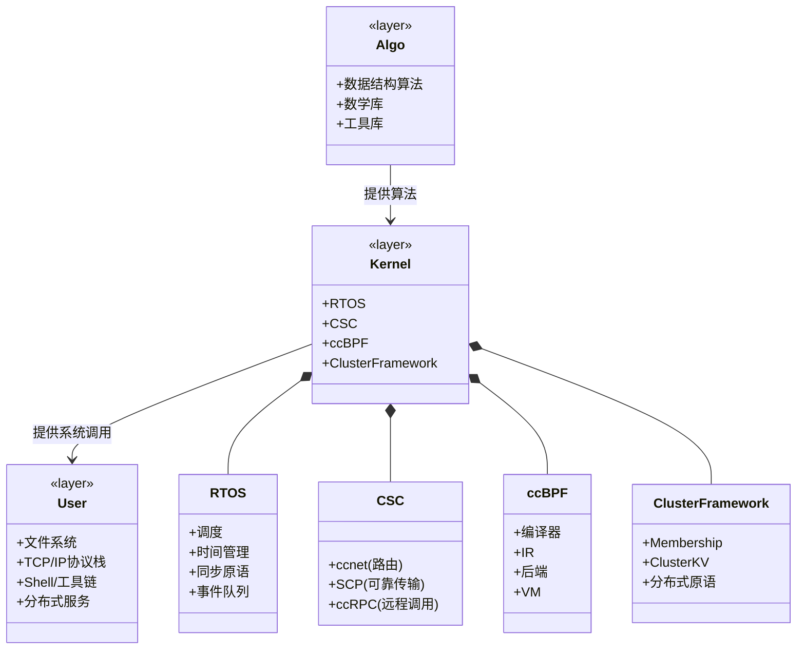
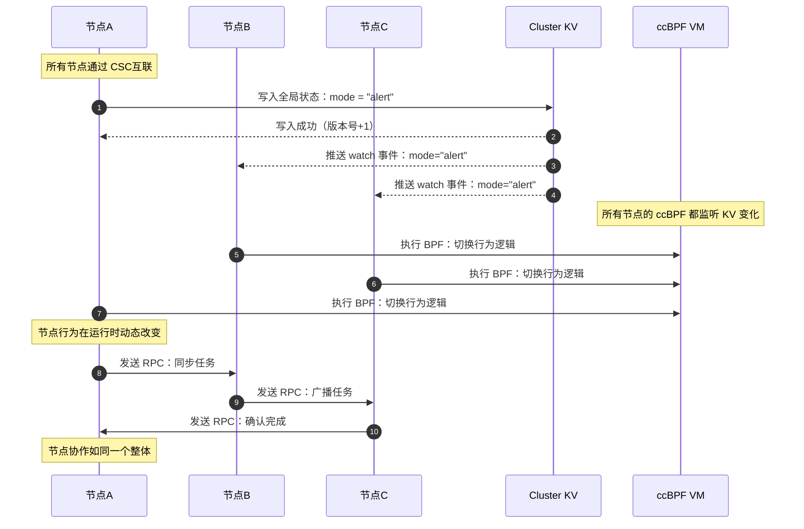

# LTTit整体设计

LTTit是一个分布式操作系统。

架构设计是：内核态运行实时调度内核、BPF虚拟机、CSC分布式协议栈、分布式框架、一切皆文件的抽象。

这些是整个lttit独特的地方：

**1.节点成为一个系统**

 **2.节点动态改变**

文件系统、TCP/IP协议栈、shell，直接调用内核的API就行了，市面上成熟的组件太多了，也不能强制绑定到内核，对于lttit来说，这些没必要放内核里面。

### 设计



lttit 采用分布式微内核架构。

系统分为两大部分：

- 内核态（Kernel Space）：提供系统级机制
- 用户态（User Space）：提供策略、服务与应用

另外，数据结构算法、数学库、内存管理算法这些基础设施。我的想法是复用算法，但不复用内存，所有关于内存的申请全部由内核或者用户自己创建。

```
算法
|
 Kernel Space
├─ RTOS（本地执行内核）
├─ CSC（跨节点通信）
├─ ccBPF（动态编程层）
└─ Cluster Framework（分布式机制）
 User Space
├─ 文件系统（littlefs）
├─ TCP/IP 协议栈（lwIP）
├─ Shell / Vim / 工具链
└─ 分布式服务与应用
```

所有用户态组件通过系统调用使用内核提供的机制。

用户通过cmake等机制，可以像搭积木一样只使用自己需要的功能。

## 内核态设计

内核态由四个核心子系统组成，它们共同构成分布式微内核。

### RTOS

RTOS 是 lttit 的本地执行内核，负责单节点的运行机制。

我原本打算把bpf虚拟机和协议栈全部塞进RTOS内核里面，不过这样看起来就像宏内核了，我的目标环境是嵌入式环境，裁剪也很不方便，还是在这些独立组件上面覆盖一层整合起来吧。

**RTOS功能**：任务调度、时间管理、同步原语、事件队列、原子操作

**设计原则**：可移植、可替换、可独立运行

### CSC

CSC 是分布式协议栈，提供跨节点通信机制。

CSC 包含三层：

### ccnet（路由层）

- 其实就一个dijkstra算法，负责路由数据包

### SCP（可靠传输协议）

- 连接管理
- 序号管理
- 保活机制
- 超时重传
- 拥塞控制

### ccrpc（远程过程调用）

- 请求/响应模型
- TLV 编码
- 自动序列化
- xdef宏魔法实现自动代码生成

CSC 是所有分布式能力的基础。

### ccBPF

ccBPF 是 lttit 的可编程策略层，用于动态控制系统行为。

### 组成

- 前端（lexer / parser / inter）
- IR（中间表示）
- 后端（lowering / selection / layout）
- VM（cbpf / ccbpf）

### 用途

* 类似Linux的eBPF，注入代码，动态改变节点行为

ccBPF 让 lttit 成为一个可动态改变的系统。

### Cluster Framework（分布式内核）

Cluster Framework 是分布式 OS 的最小机制层。

### Membership（节点成员关系）

- 节点加入/退出
- 心跳
- 节点状态同步

### Cluster KV（全局状态平面）

- 最终一致性 KV
- 版本号同步
- watch 机制
- BPF 版本号存储

### 分布式原语

* 本地与远程抽象


## 用户态设计

虽然我已经写了这些组件，但是我不得不承认，这些组件有大量可以替代的开源项目。

所以，用户态包含所有可替换、可扩展、可崩溃的组件。

### 文件系统（FS）

- littlefs 等实际 FS 在用户态运行
- 内核提供 VFS 接口
- 支持远程路径：/node/<id>/path

### TCP/IP 协议栈

- lwIP 、litterTCP在用户态运行
- 通过 CSC 或 VFS 访问网络资源

### Shell / 类Vim文本编辑器 / 工具链

- 用户态命令行
- 调试工具
- 分布式管理工具

### 分布式服务与应用

- 任务服务
- 用户自定义服务

## 系统调用设计

内核通过SVC等机制实现系统调用，所有用户态组件通过系统调用访问内核机制。

我打算实现这些系统调用：

### 系统调用分组

### 任务/进程类

- sys_spawn
- sys_exit
- sys_sleep
- sys_yield

### 同步/时间类

- sys_mutex_lock
- sys_mutex_unlock
- sys_sem_wait
- sys_sem_post
- sys_time_now

### 通信类（CSC）

- sys_send
- sys_recv
- sys_rpc_call
- sys_rpc_reply

### 分布式类（Cluster Framework）

- sys_cluster_kv_get
- sys_cluster_kv_set
- sys_cluster_barrier
- sys_cluster_broadcast

### BPF 相关

- sys_bpf_load
- sys_bpf_unload
- sys_bpf_exec 


## 最后

LTTit的特定是分布式和动态编程，我也不知道它该叫什么操作系统，所以我称之为鸟群操作系统(Tit Cluster Operating System)，因为其实我从鸟群协作中获得了灵感。

我理想中的协助是这样的：



